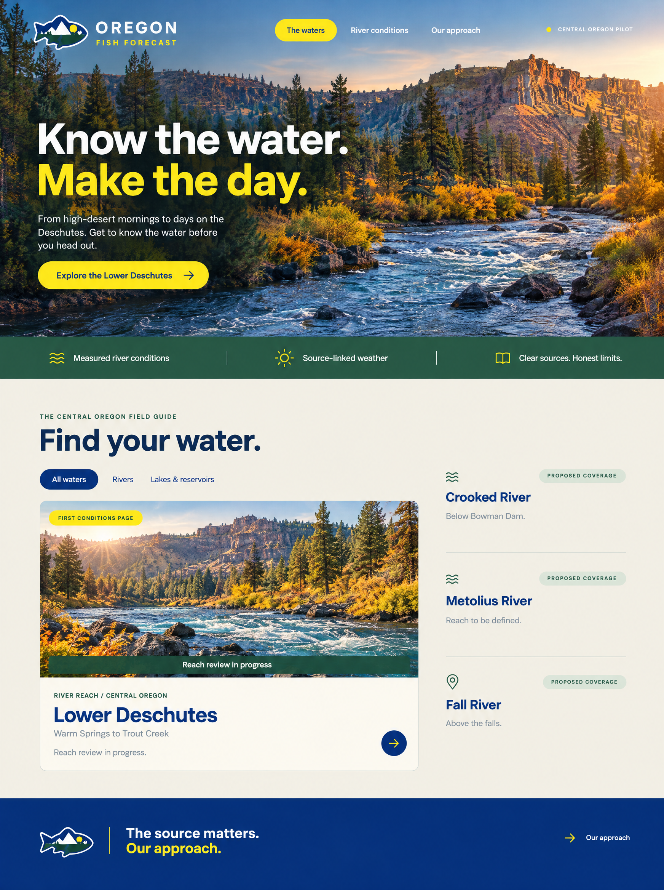
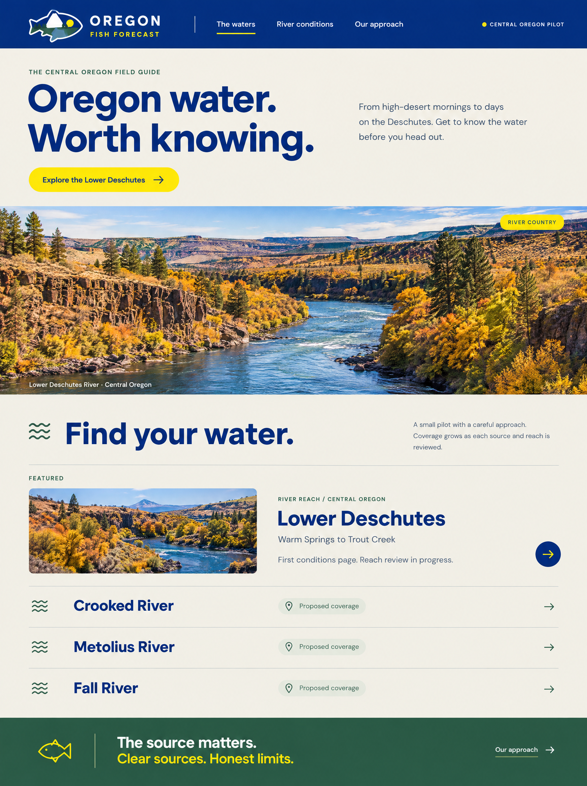
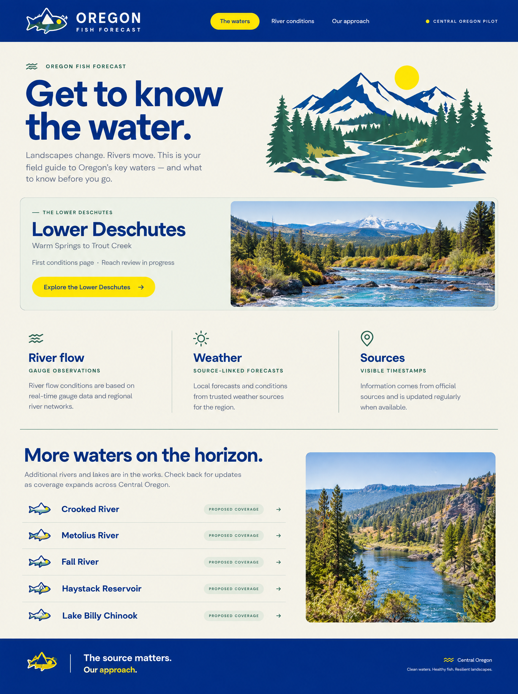

# Homepage design explorations

Three concepts generated on **2026-10-07** with **Higgsfield GPT Image2.5 Flare**, using the existing homepage and River Country logo direction as references. These are design explorations for review; they are not implemented pages or a live deployment.

Landscape imagery is illustrative and does not establish a specific fishing location or access point. Use the final approved vector logo when implementing a selected direction. Preserve the pilot's limits: Lower Deschutes reach review remains in progress, and other waters are proposed coverage.

## 1. First Light Immersion

A scenic hero, strong headline, and prominent entry point to the Lower Deschutes conditions page.

## 2. River Country Editorial

Warm paper, large blue typography, a panoramic image, and a spacious river directory.

## 3. Conditions Field Guide

A practical layout that brings the Lower Deschutes feature forward and explains the available source information.

The [generation prompts](api-prompts.json) record the intended content and visual direction. Generated text and artwork need review before implementation.
